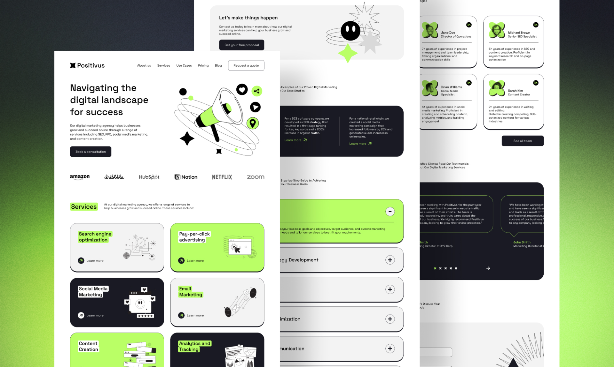

# Positivus



## Overview

Positivus is a digital marketing agency dedicated to helping businesses grow and succeed online. We offer a comprehensive range of services, including:

- **Search Engine Optimization (SEO)**
- **Pay-Per-Click Advertising (PPC)**
- **Social Media Marketing**
- **Content Creation**

Our mission is to empower businesses to achieve their goals through innovative and effective marketing strategies.

---

## Features

- **Responsive Design** for all devices
- **Interactive Components** with animations and transitions
- **Customizable UI** using reusable components
- **Optimized Performance** with modern frameworks

---

## Tech Stack

- **Next.js** (React framework for SSR and SSG)
- **React** (UI library)
- **Tailwind CSS** (utility-first CSS, configured via PostCSS)
- **TypeScript** (type-safe JavaScript)
- **Lucide Icons** (icon library)
- **AOS** (animation on scroll)
- **Lenis** (smooth scrolling)

---

## Installation

1. **Clone the repository:**
   ```bash
   git clone https://github.com/your-repo/positivus.git
   ```
2. **Navigate to the project directory:**
   ```bash
   cd positivus
   ```
3. **Install dependencies:**
   ```bash
   npm install
   ```
4. **Start the development server:**

   ```bash
   npm run dev
   ```

   > This will lint your code and start the Next.js dev server.

5. **Open your browser at** `http://localhost:3000`

---

## Project Structure

```
positivus/
├── public/                # Static assets (images, icons, etc.)
│   ├── services/          # Service-related images
│   └── teams/             # Team member images
├── src/
│   ├── app/               # App entry (Next.js 13+ routing, layout, favicon)
│   ├── components/        # Reusable UI components
│   │   ├── ui/            # UI primitives (Button, Badge, Icons)
│   │   ├── layouts/       # Layout sections (Navbar, Footer, Hero, etc.)
│   │   └── Animation/     # Animation utilities (AOSInit, Fade)
│   ├── lib/               # Utility functions (utils, lenis)
│   └── styles/            # Global and Tailwind CSS
├── package.json           # Project dependencies and scripts
├── tsconfig.json          # TypeScript configuration
├── postcss.config.mjs     # PostCSS (Tailwind) configuration
├── next.config.ts         # Next.js configuration
└── README.md              # Project documentation
```

---

## Scripts

- `npm run dev` – Lint and start the development server
- `npm run build` – Build for production
- `npm start` – Start the production server
- `npm run lint` – Format code with Prettier

---

## Deployment

1. **Build the project:**
   ```bash
   npm run build
   ```
2. **Start the production server:**
   ```bash
   npm start
   ```
   Or deploy the `.next` output to your preferred hosting provider.

---

## Contributing

1. Fork the repository
2. Create a new branch for your feature or bug fix
3. Commit and push your changes
4. Open a pull request with a detailed description

---

## License

This project is licensed under the MIT License. See the `LICENSE` file for details.
